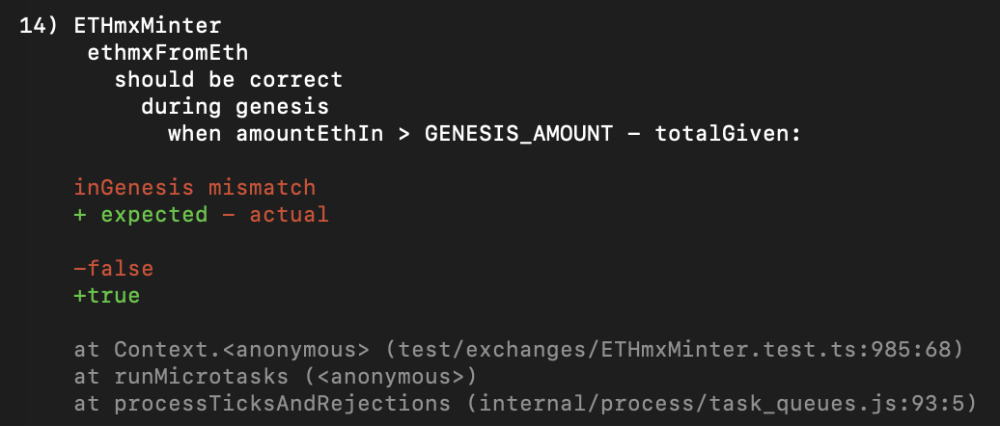

# Failed Unit Test 13 message:

### Failing code:

*ETHmxMinter.test.ts*, test *'when totalGiven == GENESIS_AMOUNT * 3 / 4'* beginning at line 928 has the following lines:

> const amount = parseEther('10');
>
> const expected = parseEther('40');
>
> expect(await contract.ethmxFromEth(amount)).to.eq(expected);

Which calls the *ethmxFromEth()* function from *ETHmxMinter.sol*, which on line 356 has:

>uint256 amountOut = _ethmxCurve(amountETHIn, mp);

(I am assuming the math inside of *_ethmxCurve* gives *amountOut* a value of *20 ETHmx*)

After which, it checks the following conditional:

> "if (_inGenesis) {...}

That ends in

>amountOut.mul(2);

However, if it continues without going inside of the conditional, *ethmxFromEth()* ends with:

> return amountOut;

without multiplying by 2, which would return the *20 ETHmx* , rather than the actual *40 ETHmx* the test expected.

The cause of the error is because in Solidity, you cannot check a truthy value this way.

From the [Solditiy docs](https://docs.soliditylang.org/en/latest/control-structures.html):

>Note that there is no type conversion from non-boolean to boolean types as there is in C and JavaScript, so if (1) { ... } is not valid Solidity.

# Failed Unit Test 14 message:

### Failing code:

*ETHmxMinter.test.ts*, test *'when amountEthIn > GENESIS_AMOUNT - totalGiven'* beginning at line 978 has the following at line 985:

> expect(await contract.inGenesis(), 'inGenesis mismatch').to.be.true;

that expects *inGenesis()* (line 493 from *ETHmxMinter.sol*) to *return true*.

*inGenesis()* returns the value of the variable *_inGenesis*, which is instantiated and imported from *ETHmxMinterData.sol* at line 46.

Prior to checking the value of the returned boolean, the test, at line 983, has the following:

>await contract.mint({ value: ethGiven });

This is important, because it is the only function call that would alter the state. Inside of *mint()* (line 155 of *ETHmxMinter.sol*) no where is the value of *_inGenesis* changed to *true*, thus it is causing it to error out.

The reason for this, is because the default value of a boolean in Solidity is *false*.

From the [Solidity docs](https://docs.soliditylang.org/en/latest/control-structures.html):

> A variable which is declared will have an initial default value whose byte-representation is all zeros. The “default values” of variables are the typical “zero-state” of whatever the type is. For example, the default value for a bool is false.