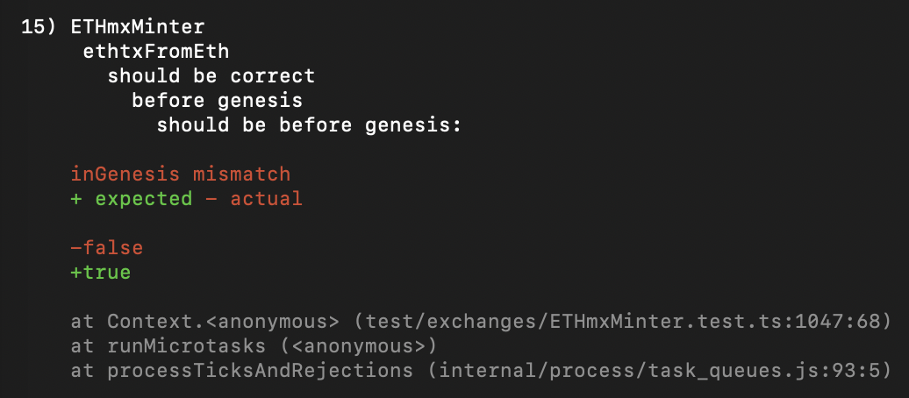
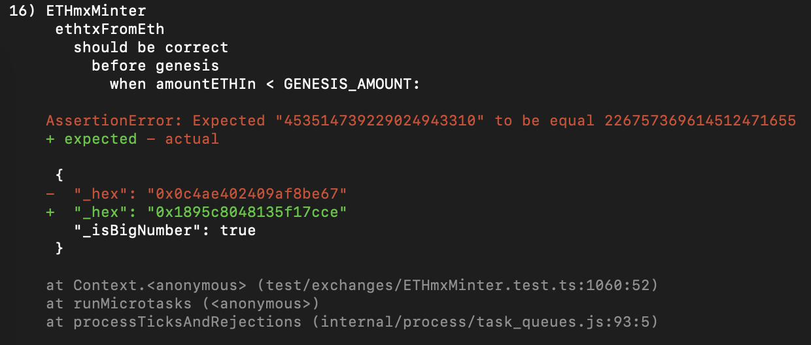
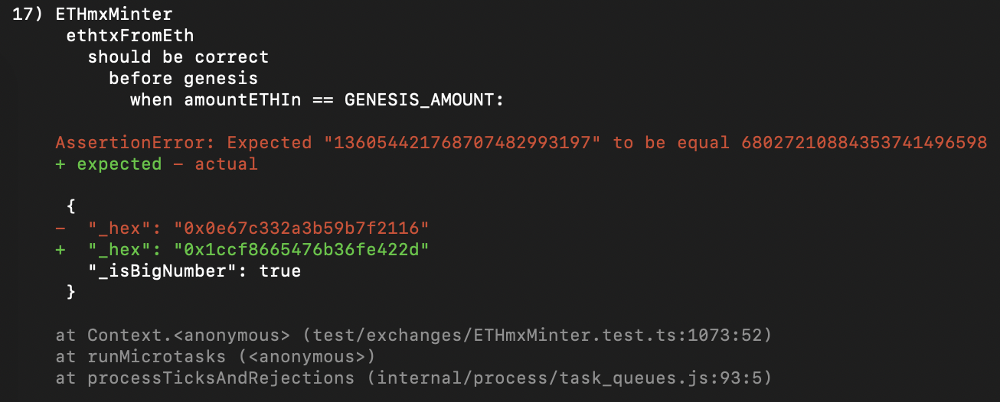
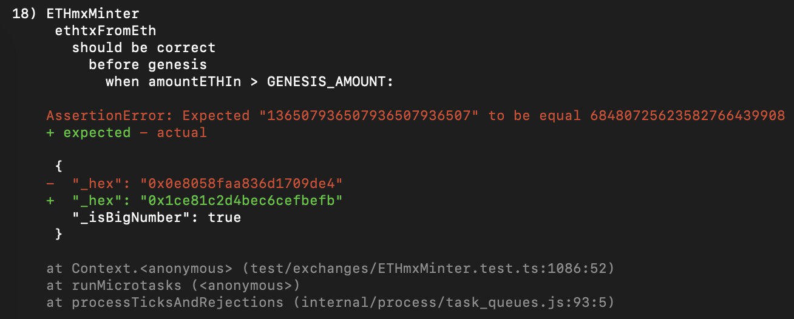

# Failed Unit Test 13 message:

### Failing code:

*ETHmxMinter.test.ts*, test *'when totalGiven == GENESIS_AMOUNT * 3 / 4'* beginning at line 928 has the following lines:

    const amount = parseEther('10');
    const expected = parseEther('40');
    expect(await contract.ethmxFromEth(amount)).to.eq(expected);

Which calls the *ethmxFromEth()* function from *ETHmxMinter.sol*, which on line 356 has:

    uint256 amountOut = _ethmxCurve(amountETHIn, mp);

(the assumption being that the math inside of *_ethmxCurve* gives *amountOut* a value of *20 ETHmx*)

After which, it checks the following conditional:

    if (_inGenesis) {...}

That ends in

    return amountOut.mul(2);

However, if it continues without going inside of the conditional, *ethmxFromEth()* ends with:

    return amountOut;

without multiplying by 2, which would return the *20 ETHmx* , rather than the actual *40 ETHmx* the test expected.

The cause of the error is because in Solidity, a boolean's value is by default false.

From the [Solidity docs](https://docs.soliditylang.org/en/latest/control-structures.html):

> A variable which is declared will have an initial default value whose byte-representation is all zeros. The “default values” of variables are the typical “zero-state” of whatever the type is. For example, the default value for a bool is false.

And *_inGenesis* is instantiated and exported from *ETHmxMinderData.sol* in line 46 as follows:

    bool internal _inGenesis;

# Failed Unit Test 14 message:

### Failing code:

*ETHmxMinter.test.ts*, test *'when amountEthIn > GENESIS_AMOUNT - totalGiven'* beginning at line 978 has the following at line 985:

    expect(await contract.inGenesis(), 'inGenesis mismatch').to.be.true;

that expects *inGenesis()* (line 493 from *ETHmxMinter.sol*) to *return true*.

*inGenesis()* returns the value of the variable *_inGenesis*, which is instantiated and imported from *ETHmxMinterData.sol* at line 46.

Prior to checking the value of the returned boolean, the test, at line 983, has the following:

    await contract.mint({ value: ethGiven });

This is important, because it is the only function call that would alter the state. Inside of *mint()* (line 155 of *ETHmxMinter.sol*) no where is the value of *_inGenesis* changed to *true*, thus it is causing it to error out.

The reason for this, is because the default value of a boolean in Solidity is *false*.

From the [Solidity docs](https://docs.soliditylang.org/en/latest/control-structures.html):

> A variable which is declared will have an initial default value whose byte-representation is all zeros. The “default values” of variables are the typical “zero-state” of whatever the type is. For example, the default value for a bool is false.

And *_inGenesis* is instantiated and exported from *ETHmxMinderData.sol* in line 46 as follows:

    bool internal _inGenesis;

Then returned from the getter function *inGenesis()* in *ETHmxMinter.sol* in 493 as follows:

    function inGenesis() external view virtual override returns (bool) {
		return _inGenesis;
	}

# Failed Unit Test 15 message:

### Failing code:

The test *'should be before genesis'* at line 1035 of *ETHmxMinter.test.ts*, has the following at line 1047:

    expect(await contract.inGenesis(), 'inGenesis mismatch').to.be.true;

Similar to unit test 14 *'when amountEthIn > GENESIS_AMOUNT - totalGiven'*, no function call before it alters the default value of _inGenesis from *ETHmxMinterData.sol* from *false* to *true*. Therefore, the error is the same, that perhaps it was assumed the default value of a boolean in Solidity is *true*.

From the [Solidity docs](https://docs.soliditylang.org/en/latest/control-structures.html):

> A variable which is declared will have an initial default value whose byte-representation is all zeros. The “default values” of variables are the typical “zero-state” of whatever the type is. For example, the default value for a bool is false.

And *_inGenesis* is instantiated and exported from *ETHmxMinderData.sol* in line 46 as follows:

    bool internal _inGenesis;

Then returned from the getter function *inGenesis()* in *ETHmxMinter.sol* in 493 as follows:

    function inGenesis() external view virtual override returns (bool) {
		return _inGenesis;
	}

# Failed Unit Test 16 message:

### Failing code (this is more speculation because I don't fully grasp some of the technical intricacies of *ETHtxAMM.sol*):

Test *'when amountETHIn < GENESIS_AMOUNT'* (line 1050 of *ETHmxMinter.test.ts*) is failing at line 1060, which has the following:

    expect(await contract.ethtxFromEth(ethIn)).to.eq(expected);

The test expects the output of *ethtxFromEth()* (line 417 in *ETHmxMinter.sol*) to equal the following (line 1054 of *ETHmxMinter.test.ts*):

    const expected = parseETHtx('226.757369614512471655');

The called function *ethtxFromEth()* has the following at lines 428-429:

    IETHtxAMM ammHandle = IETHtxAMM(_ethtxAMM);
    (uint256 collat, uint256 liability) = ammHandle.cRatio();

These create an instance of *ETHtxAMM.sol* and call the function *cRatio()* from said file (found at line 270).

The value of the *liability* variable is derived as the value of the returned variable *denominator* from *cRatio()* (line 278):

    function cRatio()
		public
		view
		virtual
		override
		returns (uint256 numerator, uint256 denominator)
	{
		numerator = ethSupply();
		denominator = ethToExactEthtx(ethtxOutstanding());
	}

When you follow the path of the rest of the called functions, it is clear it is simply arithmetic that calculates ETH to ETHtx. Therefore, the value of *liability* (which is really the value of *denominator*) should only be zero at genesis, before ETHtx have been minted.

This is important to note, because inside of *ethtxFromEth()*, there is the following conditional (line 442):

    if (liability == 0) {...}

Which it should be, because the test is setting up a simulation taking place before *GENESIS_START* (line 1018 in ETHmxMinter.test.ts):

    const unixTime = GENESIS_START - 604800;

With *GENESIS_START* being instantiated in *conversions.ts* line 10, as follows:

    export const GENESIS_START = 1620655200; // 05/10/2021 1400 UTC

Therefore, we go inside the previously mentioned conditional, which then finds another conditional (line 444 in *ETHmxMinter.sol*):

    if (_inGenesis) {...}

If we don't pass the conditional, it reaches line 457, which is as follows:

    return _ethToEthtx(basePrice, amountETHIn);

If we do pass the conditional, it reaches line 454:

    return _ethToEthtx(basePrice.mul(2), amountETHIn);

With the only difference of the two being whether *basePrice* is multiplied by two. Seeing as how the test expected the actual output to be halved if we *_inGenesis = true*, the speculation is that the test is supposed to enter the conditional and have it's base price doubled, thus giving half as many ETHtx.

The reason for this, is because the default value of a boolean in Solidity is *false*.

From the [Solidity docs](https://docs.soliditylang.org/en/latest/control-structures.html):

> A variable which is declared will have an initial default value whose byte-representation is all zeros. The “default values” of variables are the typical “zero-state” of whatever the type is. For example, the default value for a bool is false.

And *_inGenesis* is instantiated and exported from *ETHmxMinderData.sol* in line 46 as follows:

    bool internal _inGenesis;

# Failed Unit Test 17 message:

### Failing code:

Test *'when amountETHIn == GENESIS_AMOUNT'* is erroring out in a very similar manner to unit test 16, where the actual output and the expected output is a difference of 2X. In this case, line 1073 is as follows:

    expect(await contract.ethtxFromEth(ethIn)).to.eq(expected);

and lines 1066-1067 declare both *ethIn* and *expected* equal as follows:

    const ethIn = GENESIS_AMOUNT;
    const expected = parseETHtx('68027.210884353741496598');

with *GENESIS_AMOUNT* being instantiated in *conversions.ts* (line 9) as follows:

    export const GENESIS_AMOUNT = parseEther('3000');

Because the test is failing at the same point unit test 16 was failing, which is when calling the *ethtxFromEth()* function, and because following the path of code leads to the same conditional at line 44 in *ETHmxMinter.sol*

    if (_inGenesis) {...}

It appears the error is again the fact that the conditional was written such that it would prove a boolean value to be *true*. If *_inGenesis* is by default true, which would then proceed to increase the base price of ETHtx by 2X, with line 454, which reads as follows:

    return _ethToEthtx(basePrice.mul(2), amountETHIn);

Instead, it reads the following line at 457 as:

    return _ethToEthtx(basePrice, amountETHIn);

It would be reasonable to assume that the error is, again, being caused by the correct assumption a boolean's default value is *true*.

The reason for this, is because the default value of a boolean in Solidity is *false*.

From the [Solidity docs](https://docs.soliditylang.org/en/latest/control-structures.html):

> A variable which is declared will have an initial default value whose byte-representation is all zeros. The “default values” of variables are the typical “zero-state” of whatever the type is. For example, the default value for a bool is false.

And *_inGenesis* is instantiated and exported from *ETHmxMinderData.sol* in line 46 as follows:

    bool internal _inGenesis;

# Failed Unit Test 18 message:

### Failing code:

Test *'when amountETHIn > GENESIS_AMOUNT'* at line 1086 of *ETHmxMinter.test.ts*. The line is as follows:

    expect(await contract.ethtxFromEth(ethIn)).to.eq(expected);

With *ethIn* and *expected* being instantiated at lines 1079-1081 as follows:

    const ethOver = parseEther('10');
    const ethIn = GENESIS_AMOUNT.add(ethOver);
    const expected = parseETHtx('68480.725623582766439908');

With *GENESIS_AMOUNT* being instantiated and exported from *conversions.ts* at line 9 as follows:

    export const GENESIS_AMOUNT = parseEther('3000');

All of this ultimately calls *ethtxFromEth()* inside of *ETHmxMinter.sol*, which similar to before, reaches this conditional at line 444:

    if (_inGenesis) {...}

Therefore, it appears the problem is, once again, that *_inGenesis* is incorrectly assumed to equal *true*, which it is not, according to line 46 in *ETHmxMinterData.sol* that instantiated it as follows:

    bool internal _inGenesis;

From the [Solidity docs](https://docs.soliditylang.org/en/latest/control-structures.html):

> A variable which is declared will have an initial default value whose byte-representation is all zeros. The “default values” of variables are the typical “zero-state” of whatever the type is. For example, the default value for a bool is false.

